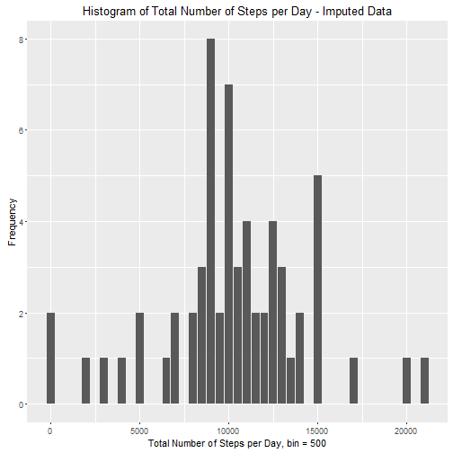

# Peer-Graded Assignment: Course Project 1


```r
options(scipen = 999)
library(ggplot2)
library(dplyr)
```

## Loading and preprocessing the data

#### 1.Load the data (i.e. read.csv())

```r
if(!file.exists('activity.csv')) {
  unzip('repdata%2Fdata%2Factivity.zip')
}
activity <- read.csv('activity.csv')
```
#### 2. Process/transform the data (if necessary) into a format suitable for your analysis
###### Summarize data into steps by dates, assume missing steps are 0 for the purpose of histogram:

```r
activity <- mutate(activity, steps_hist = ifelse(is.na(activity$steps), 0, activity$steps))
sum_stepsbydate <- group_by(activity, date)
```

## What is mean total number of steps taken per day?
#### 1. Calculate the total number of steps taken per day

```r
sum_stepsbydate <- summarize(sum_stepsbydate, steps=sum(steps_hist))
```

#### 2.If you do not understand the difference between a histogram and a barplot, research the difference between them. Make a histogram of the total number of steps taken each day

```r
hist_data <- mutate(sum_stepsbydate, steps_flr = floor(steps/500)*500)
ggplot(hist_data)+geom_bar(aes(x=steps_flr))+xlab("Total Number of Steps per Day, bin = 500")+ylab("Frequency")+ggtitle("Histogram of Total Number of Steps per Day")
```


#### 3. Calculate and report the mean and median of the total number of steps taken per day

```r
stepbydate_arr <- group_by(sum_stepsbydate)
stepbydate_mean <- summarise(stepbydate_arr, temp_mean = mean(as.numeric(stepbydate_arr$steps)))
stepbydate_median <- summarise(stepbydate_arr, temp_median = median(as.numeric(stepbydate_arr$steps)))
```

Mean: 9354.2295082

Median: 10395


## What is the average daily activity pattern?
#### 1.Make a time series plot (i.e. type = "l") of the 5-minute interval (x-axis) and the average number of steps taken, averaged across all days (y-axis)

```r
stepsby5int <- group_by(activity, interval)
stepsby5int <- summarise(stepsby5int, mean_steps = mean(steps_hist))
ggplot(stepsby5int)+geom_line(aes(x=interval, y=mean_steps))+xlab("Time Intervals - 5 minutes")+ylab("Average Number of Steps")+ggtitle("Time Series: Average Steps per 5 Minutes Interval")
```


#### 2.Which 5-minute interval, on average across all the days in the dataset, contains the maximum number of steps?


```r
stepsby5int_max <- filter(stepsby5int, mean_steps == max(mean_steps))$interval
```

Interval for Maximum Average Steps: 835 

## Imputing missing values
#### 1.Calculate and report the total number of missing values in the dataset (i.e. the total number of rows with NAs)


```r
activity_miss <- length(which(is.na(activity)))
```
Number of rows with missing values: 2304

#### 2.Devise a strategy for filling in all of the missing values in the dataset. The strategy does not need to be sophisticated. For example, you could use the mean/median for that day, or the mean for that 5-minute interval, etc.
#### Chosen strategy: Impute all missing steps with mean for that 5-minute interval

```r
activity_imp <- merge(activity, stepsby5int, by.x="interval", by.y="interval")
activity_imp <- mutate(activity_imp, steps= ifelse(is.na(steps), mean_steps, steps))
```

#### 3.Create a new dataset that is equal to the original dataset but with the missing data filled in.

```r
activity_imp<-select(activity_imp, interval, steps, date)
```

#### 4.Make a histogram of the total number of steps taken each day and Calculate and report the mean and median total number of steps taken per day. Do these values differ from the estimates from the first part of the assignment? What is the impact of imputing missing data on the estimates of the total daily number of steps?

```r
sum_stepsbydate_imp <- group_by(activity_imp, date)
sum_stepsbydate_imp <- summarize(sum_stepsbydate_imp, steps=sum(steps))
hist_data_imp <- mutate(sum_stepsbydate_imp, steps_flr = floor(steps/500)*500)
ggplot(hist_data_imp)+geom_bar(aes(x=steps_flr))+xlab("Total Number of Steps per Day, bin = 500")+ylab("Frequency")+ggtitle("Histogram of Total Number of Steps per Day - Imputed Data")
```



```r
stepbydate_arr_imp <- group_by(sum_stepsbydate_imp)
stepbydate_mean_imp <- summarise(stepbydate_arr_imp, temp_mean = mean(as.numeric(stepbydate_arr_imp$steps)))
stepbydate_median_imp <- summarise(stepbydate_arr_imp, temp_median = median(as.numeric(stepbydate_arr_imp$steps)))
```

Impact on Histogram: Missing steps were previously assumed to be 0. The frequency for 0 steps based on imputed data has spread to other values since the 5-minute interval mean is assigned.

Difference on overall mean: 1226.7841978 higher than original mean.

Difference on overall median: 0, no impact.

## Are there differences in activity patterns between weekdays and weekends?

#### 1.Create a new factor variable in the dataset with two levels - "weekday" and "weekend" indicating whether a given date is a weekday or weekend day.


```r
activity_imp_days <- mutate(activity_imp,weekday_type=ifelse(as.POSIXlt(date)$wday %in% c(1:5), "weekday", "weekend"))
```
#### 2.Make a panel plot containing a time series plot (i.e. type = "l") of the 5-minute interval (x-axis) and the average number of steps taken, averaged across all weekday days or weekend days (y-axis). See the README file in the GitHub repository to see an example of what this plot should look like using simulated data.

```r
activity_imp_days <- group_by(activity_imp_days, interval, weekday_type)
sum_activity_imp_days <- summarise(activity_imp_days, mean_steps = mean(steps))
ggplot(sum_activity_imp_days, aes(interval, mean_steps))+geom_line()+facet_grid(weekday_type ~ .)+xlab("Time interval - 5 Minutes")+ylab("Average Number of Steps")+ggtitle("Average Number of Steps by 5 Minute Invertals - Weekdays vs Weekends")
```


